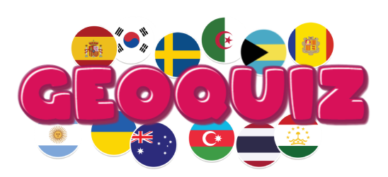
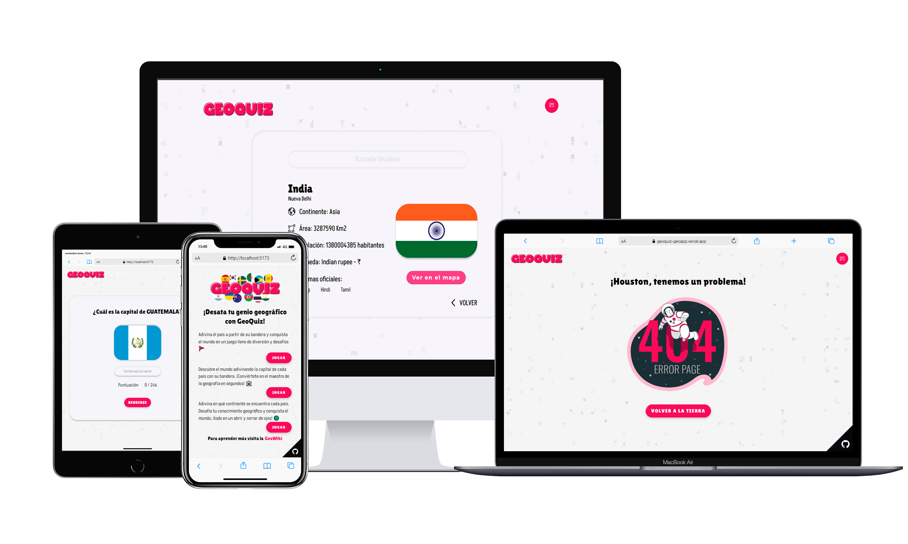

  

 

# GeoQuiz

Bienvenid@s a GeoQuiz 🌍, con esta App podrás poner a prueba tus conocimientos de geografía.

Adivina el país a partir de su bandera, descubre el mundo adivinando la capital de cada país o trata de averiguar en que continente se encuentra cada uno. ¡Conviértete en un maestro de la geografía 📚!

O por el contrarío, si lo que quieres es aprender más, visita el aparto de GeoWiki 🔍, dónde podrás encontrar información detallada de cada país como su capital, población, moneda, mapa...

[Sitio Web](https://geoquiz-geoapp.vercel.app/) 🖥️

## Sobre el proyecto

* Diseño responsive, garantizando que los usuarios puedan disfrutar plenamente de la aplicación independientemente del dispositivo que utilicen, desde un teléfono móvil hasta una pantalla de escritorio.

* Integrada por dos APIs, la API https://restcountries.com/ para obtener datos detallados de los diferentes países del mundo y la API de traducción https://api.textcortex.com/v1/texts/translations, para así poder ofrecer una experiencia completa en español.

* Diseñada y prototipada con Figma, lo que me permitió visualizar de manera efectiva la estructura y el flujo de la aplicación.

* Asumí el reto de desarrollar la aplicación utilizando TypeScript y Tailwind CSS a pesar de no tener experiencia previa con estos lenguajes. Fue un desafío emocionante y enriquecedor, permitiéndome ampliar mis habilidades y conocimientos en el desarrollo web.

## Tecnologías utilizadas

&nbsp;&nbsp;&nbsp;
&nbsp;&nbsp;&nbsp;
&nbsp;&nbsp;&nbsp;
&nbsp;&nbsp;&nbsp;

